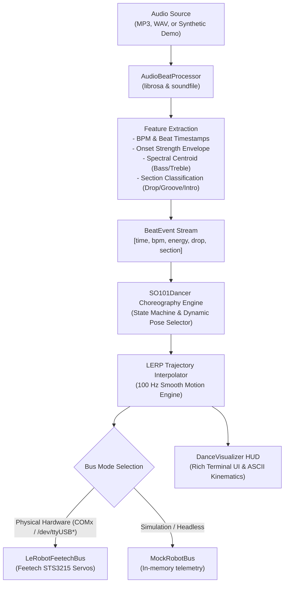
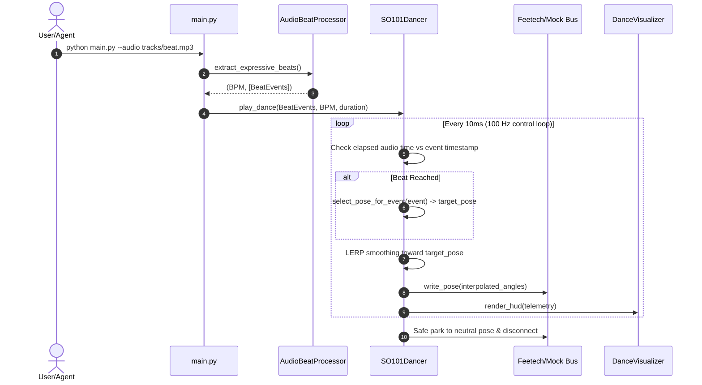

# System Architecture & Technical Specifications

> **BeatSync SO-101: Expressive Audio-Driven Robotic Dancer**  
> Physical AI Hackathon · DARE Campus, Zurich

---

## 1. High-Level System Overview

BeatSync SO-101 is an end-to-end Physical AI system that transforms raw musical audio into synchronized, expressive 6-DOF robotic choreography. It bridges high-level musical information retrieval (MIR) with low-level embedded motor bus control.



---

## 2. Core Architectural Components

### 2.1 Audio Processing Pipeline (`src/audio_processor.py`)
The audio processor extracts temporal and harmonic features from the audio stream without requiring neural network inference latency:

1. **Beat Tracking & Tempo Estimation**:
   - Uses `librosa.beat.beat_track` to detect frame-level onsets and derive the primary tempo ($BPM$).
2. **Dynamic Energy Profiling**:
   - Computes normalized onset strength envelope: $E(t) = \frac{\text{onset}(t)}{\max(\text{onset})}$.
3. **Drop & Transition Detection**:
   - Compares the instantaneous onset energy against preceding frames:
     $$\Delta E = E(t) - E(t - \Delta t)$$
     A beat is tagged as `is_drop = True` when $E(t) > 0.65$ and $\Delta E > 0.25$.
4. **Spectral Profiling**:
   - Evaluates spectral centroid to differentiate between heavy sub-bass kicks and high-frequency percussive elements (hi-hats, claps).
5. **Section Classifier**:
   - Segment classification into `intro`, `chill`, `groove`, and `drop`.

#### `BeatEvent` Data Model
```python
@dataclass
class BeatEvent:
    time: float          # Absolute timestamp in seconds
    bpm: float           # Current tempo
    energy: float        # Normalized intensity [0.0, 1.0]
    is_downbeat: bool    # True if bar initiation (beat 1 of 4)
    is_drop: bool        # True if sudden high-energy transition
    section: str         # "intro" | "groove" | "buildup" | "drop"
```

---

### 2.2 Robot Choreography & Motion Engine (`src/robot_controller.py`)

#### 6-DOF Joint Kinematic Mapping
The SO-101 (SO-ARM100) follower arm features 6 serial Feetech STS3215 smart servos:

| Joint | Servo ID | Safe Range | Primary Motion Role |
| :--- | :---: | :---: | :--- |
| `shoulder_pan` | 1 | -90° to +90° | Base sway, left/right swing |
| `shoulder_lift` | 2 | -60° to +60° | Vertical bobbing, body rise/fall |
| `elbow_flex` | 3 | -90° to +90° | Forearm rhythm, bounce accent |
| `wrist_flex` | 4 | -90° to +90° | Head nods, beat accent |
| `wrist_roll` | 5 | -90° to +90° | Flairs, waving, drop accents |
| `gripper` | 6 | 0 to 100% | Rhythmic claps, beat snaps |

#### Smooth Trajectory Interpolation (LERP)
Physical smart servos risk mechanical wear and gear stripping if commanded with discontinuous step targets. The control loop runs at **100 Hz** ($10\,\text{ms}$ cycle), applying exponential linear interpolation:

$$\theta_{\text{interpolated}}(t + \Delta t) = \theta(t) + \alpha \cdot \left(\theta_{\text{target}} - \theta(t)\right)$$

Where $\alpha = 0.35$. This guarantees snappy, musical responsiveness while preserving smooth, organic movement and protecting servo gearboxes.

#### Abstract Bus Interface
The controller abstracts hardware communication behind `BaseRobotBus`:
- `LeRobotFeetechBus`: Interfaces with Hugging Face's `lerobot.motors.feetech.feetech.FeetechMotorsBus` with calibrated `MotorNormMode.DEGREES` and `MotorNormMode.RANGE_0_100`.
- `MockRobotBus`: Zero-dependency virtual bus that maintains internal state for hardware-free simulation, automated unit testing, and terminal visualizer rendering.

---

### 2.3 Real-Time Terminal Visualizer (`src/visualizer.py`)
Built with `rich`, the visualizer renders 30 FPS telemetry:
- Live track timeline, current timestamp vs duration, and detected BPM.
- Real-time ASCII energy meter and current musical section badge (`GROOVE`, `DROP`, `INTRO`).
- Full 6-DOF joint telemetry table showing real-time angles and visual position gauges.
- Expressive ASCII kinematic representation displaying the arm's instantaneous spatial posture.

---

### 2.4 Agent Skill Integration (`.agents/skills/dance-controller/SKILL.md`)
The repository includes an Antigravity Agent Skill. This allows AI assistants in the IDE to:
- Automatically inspect connected serial ports.
- Trigger choreography routines and simulation runs.
- Adjust musical parameters or test novel choreographic poses autonomously.

---

## 3. Data Flow & Execution Sequence


